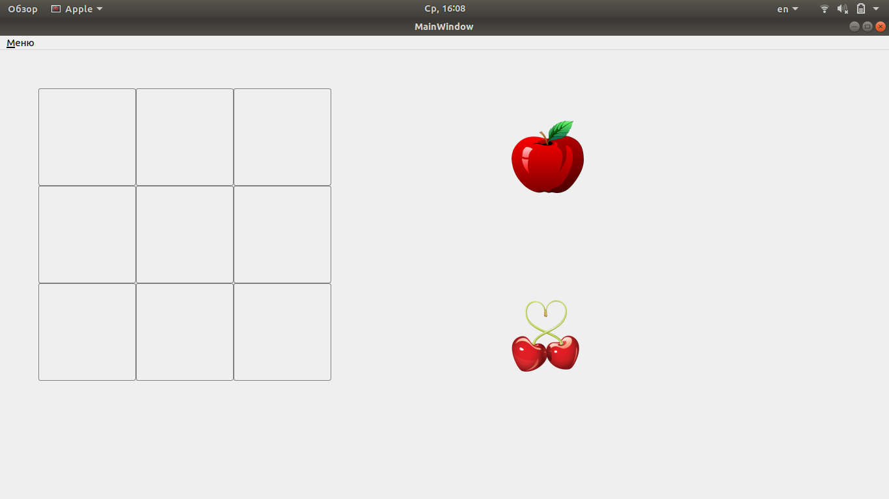
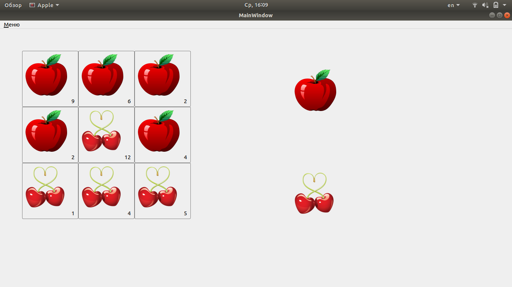

# qt-appleGame

I. Описание GUI и взаимодействия пользователя с ним.
1. В верхнем виджете QMenu расположены две кнопки: "Новая игра" и "Выход".
2. Нажатие на кнопку "Выход" приводит к закрытию программы.
3. Нажатие на кнопку "Новая игра" инициирует начало новой игры.
4. После нажатия на кнопку новая игра обнуляется виджет "Игровое поле", 
а база данных чистится.
6. На игровом поле слева расположен виджет QGridLayout - "Инвентарь",
размерностью 3х3, все ячейки таблицы инвентаря квадратной формы.
7. На игровом поле справа расположены виджеты Item (предмет) "Яблоко" и 
"Груша", являющиеся источниками для Drag'n'Drop'a в ячейки Инвентаря.
Предметы в этом виджете бесконечные, можно брать из источника и
перетаскивать в инвентарь неограниченное количество раз.
8. При перетаскивании яблока или груши из источника в инвентарь, предмет 
появляется в той ячейке инвентаря, в которую осуществлено перетаскивание.
Так же возможно перетаскивание предмета внутри ячеек инвентаря. Внутри
инвентаря предметы перетаскиваются всей пачкой,
т.е. к примеру, если в ячейке было 3 яблока, перетаскиваются все три.
9. При повторном перетаскивании предмета из источника в инвентарь в ту
ячейку, где уже есть этот же предмет (напрмпер, яблоко в яблоко), количество 
предметов (яблок) в этой ячейке увеличивается на 1.
Справа снизу от предмета в ячейке инвентаря находится цифра, указывающая
на количество предметов в ячейке. К примеру, было одно яблоко, цифра 1,
после перетаскивания стало два яблока, стала цифра два.
10. При клике правой кнопкой мыши по ячейке инвентаря с предметом
происходит уменьшение количества предметов в ячейке. Например, если там
было три яблока, при клике правой мыши счетчик яблок становится равен 2.
Если был один предмет, то картинка предмета исчезает. Если предметов было
больше одного, цифра должна уменьшится на единицу.
11. При исчезновении предметов по правому клику мыши воспроизводится звук
откусывания предмета (разный для "Яблока" и "Груши").
12. При клике левой кнопки мыши счтчик предмета увеличивается на 1.

II. Описание классов программы и описание её работы.
1. Класс "Предмет". Содержит в себе перегруженный конструктор. Первый - для 
создания "бесконечного" Item без счетчика и без возможности изменять Item 
по клику мыши. Второй - для создания Item в ячейках Инвенторя, с изменяющимся
счетчиком и возможностью изменять количество предметов по клику мыши.
Описывает предмет инвенторя и содержит в себе поля: Тип предмета, счетчик, 
номер строки (из Инвенторя), номер колонки (из Инвенторя), указатель на БД, 
указатель на родительский виджет, бесконечный ди предмет или нет (для создания 
двух drag предметов, из которых может перетаскиваться один премет беконечное 
количество раз), изображение предмета (путь к изображению в ресурсах), звук 
откусывания предмета (путь к звуку в ресурсах).
2. Класс "Ячейка". Содержит в себе возможность drop. (из Item drag  в ячейку drop).
Содержит в себе поля: номер строчки в инвенторе, номер колонки в инвенторе.
Вызывает в конструкторе создание Item и передает в него количество предметов и 
тип предметов.
3. Класс "Инвентарь". Конструктор принимает его размер (высоту и ширину). 
Содержит в себе поле - матрица ячеек.
4. База данных SQLite. Содержит в себе таблицу которая хранит данные 
указанных выше классов. В ней отражается номер строчки инвенторя, номер колонки
инвенторя, тип предмета, находящегося в инвенторе, количество предметов, 
находящихся в ячейке инвенторя.

